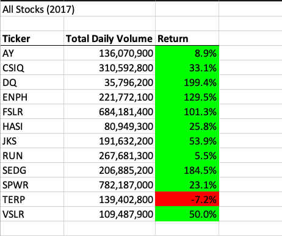
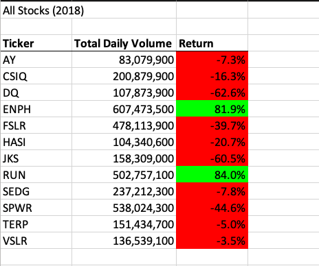
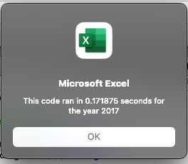
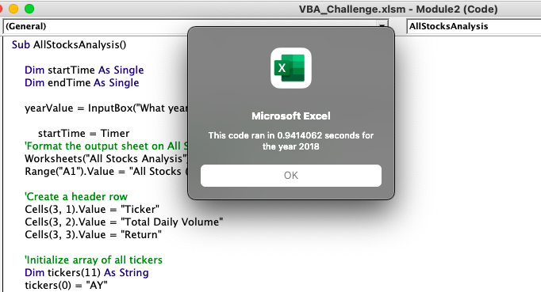
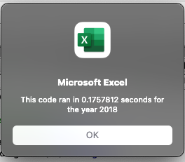

# stocks-analysis

## Overview of Project

### Purpose
The purpose of this project was to refactor VBA codes to loop through stock data from the year 2017 and 2018. Refactoring the code allows us to collect information more expeditiously. 

## Results

### Analysis

All stocks we analyzed in 2017 except for 'TERP' came back with positive returns and are worth doing more research into before investing. Our main objective was to determine whether or not 'DQ' was worth investing and we can easiy determine that it is based on our analysis with the available data. However there are other stocks that may be a better option when it comes to return on investment, stocks such as 'ENPH', 'FSLR', and 'SEDG' had more significant Total Daily Volume when compared to 'DQ'.

Analysis in 2018 on the same stocks as the previous year tells us a completely different story. Most stocks except for 'ENPH' and 'RUN', had a negative return. 'ENPH' and 'RUN' had a significant increase in their Total Daily Volume, which others had a decrease in their Total Daily Volume which reflected negatively in their Returns. Based on the analysis and comparison of stock data from both years, it would be safe to say that 'ENPH' and 'RUN' would be ideal stocks to invest in. 

##Summary

An advantage of refactoring code is to make it more efficient and more easily readible. The following are examples of the advantages of refactoring. 

After refactoring, run time was significantly quicker than the original. 
One major disadvantage to refactoring code is a possible mistake can render the code useless and will be time consuming to go back and identify the problem. Another disadvantage when refactoring is deciphering previously written code and how to make it more efficient which can be time consuming if the previous code was written sloppily. That is why having comments within VBA can be advantageous if refactoring was a goal. 
